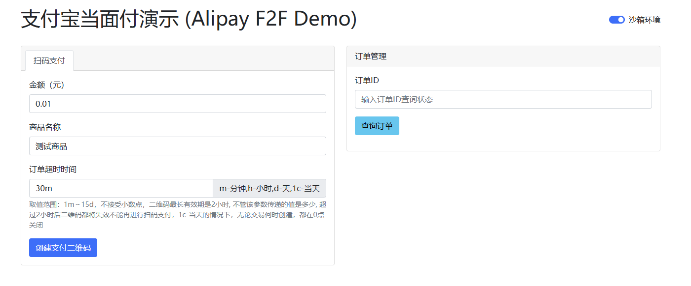

# Alipay F2F Demo (支付宝当面付演示)

这是一个使用 FastAPI 实现的支付宝当面付（Face to Face）支付演示项目。本项目展示了如何集成支付宝当面付的扫码支付功能，适合想要了解支付宝当面付接入流程的开发者参考。

## 功能特点

- 支持生成支付二维码
- 实时订单状态查询
- 支持沙箱环境和正式环境切换
- 订单超时自动关闭
- 完整的支付流程演示

## 安装说明

1. 克隆项目到本地
    ```bash
    git clone https://github.com/HG-ha/Alipay-F2F-Demo
    cd Alipay-F2F-Demo
    ```

2. 安装依赖
    ```bash
    pip install -r requirements.txt
    ```

3. 配置支付宝参数
    - 在 `utils` 下创建 `config.py` 文件，填入您的支付宝应用参数：
    - ALIPAY_APPID：应用ID
    - APP_PRIVATE_KEY：应用私钥
    - ALIPAY_PUBLIC_KEY：支付宝公钥
    - SAND_BOX_APPID：沙箱环境应用ID
    - SAND_BOX_APP_PRIVATE_KEY：沙箱环境应用私钥
    - SAND_BOX_ALIPAY_PUBLIC_KEY：沙箱环境支付宝公钥
    - 沙箱工具下载: [https://open.alipay.com/develop/sandbox/tool](https://open.alipay.com/develop/sandbox/tool)

    - 示例配置文件 (config.py):
        ```python
        # 支付宝应用相关配置
        ALIPAY_APPID = "2021000000000000"  # 请替换为您的APPID

        # 应用私钥（PKCS1格式，掐头去尾，不换行不空格）
        APP_PRIVATE_KEY = """MIIEpAIBAAKCAQEAnxxx...（示例密钥，需要替换）...xxx"""

        # 支付宝公钥 (确保密钥格式正确，包含头部和尾部)
        ALIPAY_PUBLIC_KEY = """
        -----BEGIN PUBLIC KEY-----
        MIIBIjANBgkqhkiG9w0BA...（示例密钥，需要替换）...xxx
        -----END PUBLIC KEY-----
        """

        # 沙箱配置
        SAND_BOX_APPID = "2021000000000000"  # 请替换为您的APPID

        # 应用私钥（PKCS1格式，掐头去尾，不换行不空格）
        SAND_BOX_APP_PRIVATE_KEY = """MIIEpAIBAAKCAQEAnxxx...（示例密钥，需要替换）...xxx"""

        # 支付宝公钥 (确保密钥格式正确，包含头部和尾部)
        SAND_BOX_ALIPAY_PUBLIC_KEY = """
        -----BEGIN PUBLIC KEY-----
        MIIBIjANBgkqhkiG9w0BA...（示例密钥，需要替换）...xxx
        -----END PUBLIC KEY-----
        """
        ```

## 运行项目

```bash
python main.py
```
访问 http://localhost:8000 即可看到演示页面

## 开发环境

- Python 3.7+
- FastAPI
- alipay-sdk-python
- uvicorn

## 目录结构

```
支付宝当面付/
├── main.py              # 主程序入口
├── requirements.txt     # 依赖列表
├── static/             # 静态文件
│   ├── css/
│   └── js/
├── templates/          # 模板文件
│   └── index.html
└── utils/             # 工具类
    ├── alipay_utils.py
    └── config.py
```

## 注意事项

- 请确保在生产环境中妥善保管好密钥信息
- 建议在正式使用前充分测试沙箱环境
- 请遵守支付宝相关的接入规范和要求



## 许可证

MIT License
